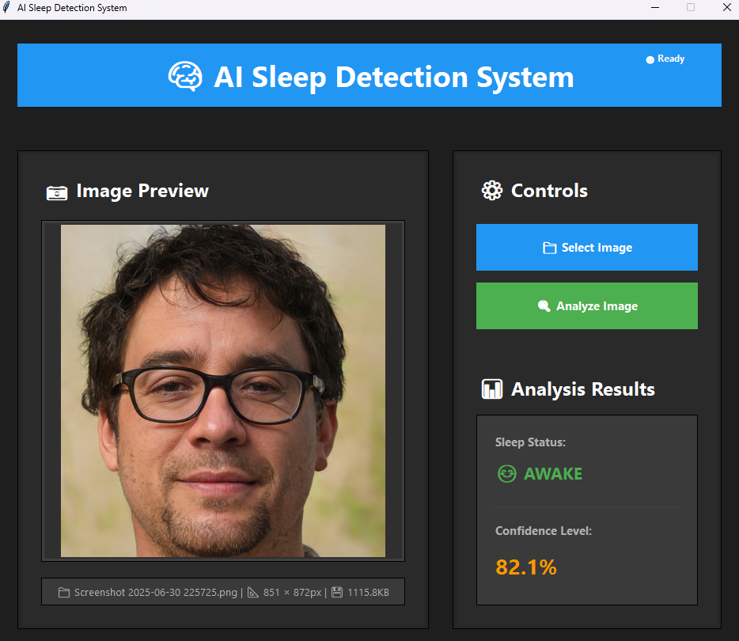

# 🧠 AI Sleep Detection System

A modern desktop application that uses artificial intelligence to detect sleep states from facial images. Built with Python, TensorFlow/Keras, and Tkinter with a sleek dark theme interface.



## ✨ Features

- **AI-Powered Detection**: Uses trained neural network model for accurate sleep state classification
- **Modern Dark UI**: Sleek, user-friendly interface with dark theme
- **Real-time Analysis**: Fast image processing and prediction
- **Multiple Format Support**: JPG, PNG, BMP, GIF, TIFF image formats
- **Confidence Scoring**: Shows prediction confidence percentage
- **Visual Feedback**: Animated progress indicators and result highlighting

## 🚀 Quick Start

### Prerequisites

- Python 3.8 or higher
- pip package manager

### Installation

1. **Clone the repository**
   ```bash
   git clone https://github.com/yourusername/sleep-detection-ai.git
   cd sleep-detection-ai
   ```

2. **Create virtual environment**
   ```bash
   python -m venv .venv
   
   # Windows
   .venv\Scripts\activate
   
   # macOS/Linux
   source .venv/bin/activate
   ```

3. **Install dependencies**
   ```bash
   pip install -r requirements.txt
   ```

4. **Run the application**
   ```bash
   python player.py
   ```

## 📋 Requirements

Create a `requirements.txt` file with these dependencies:

```
tensorflow==2.12.1
pillow==10.0.0
numpy==1.24.3
```

## 🎯 How to Use

1. **Launch the Application**
   - Run `python player.py`
   - Wait for the AI model to load (green "Ready" indicator)

2. **Select an Image**
   - Click "📁 Select Image" button
   - Choose a clear photo with visible face
   - Image preview will appear on the left panel

3. **Analyze the Image**
   - Click "🔍 Analyze Image" button
   - Wait for AI analysis to complete
   - View results in the right panel

4. **Interpret Results**
   - **Status**: Shows "😴 SLEEPING" or "😊 AWAKE"
   - **Confidence**: Percentage indicating prediction certainty
   - **Color Coding**: 
     - Green (85%+): High confidence
     - Orange (70-84%): Medium confidence
     - Red (<70%): Low confidence

## 🏗️ Project Structure

```
sleep-detection-ai/
├── player.py              # Main application file
├── keras_Model.h5          # Trained AI model
├── labels.txt             # Class labels file
├── requirements.txt       # Python dependencies
├── README.md             # Project documentation
├── .gitignore           # Git ignore file
└── screenshots/         # Demo images
    └── demo_screenshot.png
```

## 🧪 Model Information

- **Architecture**: Convolutional Neural Network (CNN)
- **Framework**: TensorFlow/Keras
- **Input Size**: 224x224x3 (RGB images)
- **Classes**: Sleep, Awake
- **Preprocessing**: Image normalization and resizing

## 🎨 UI Features

- **Dark Theme**: Easy on the eyes with modern color scheme
- **Responsive Layout**: Two-panel design with image preview and controls
- **Visual Feedback**: Progress bars, hover effects, and result animations
- **Image Information**: Displays file details (name, dimensions, size)

## 🔧 Technical Details

### Dependencies
- **TensorFlow**: AI model inference
- **Pillow (PIL)**: Image processing and display
- **NumPy**: Numerical computations
- **Tkinter**: GUI framework (built into Python)

### System Requirements
- **OS**: Windows 10/11, macOS 10.14+, or Linux
- **RAM**: Minimum 4GB (8GB recommended)
- **Storage**: 100MB free space
- **Python**: 3.8 - 3.11


## 🤝 Contributing

1. Fork the repository
2. Create your feature branch (`git checkout -b feature/AmazingFeature`)
3. Commit your changes (`git commit -m 'Add some AmazingFeature'`)
4. Push to the branch (`git push origin feature/AmazingFeature`)
5. Open a Pull Request

## 📝 License

This project is licensed under the MIT License - see the [LICENSE](LICENSE) file for details.

## 🙏 Acknowledgments

- TensorFlow team for the machine learning framework
- Tkinter developers for the GUI toolkit
- The open-source community for inspiration and resources

## 📞 Support

If you have any questions or issues:

1. Check the [Issues](https://github.com/yourusername/sleep-detection-ai/issues) page
2. Create a new issue with detailed description
3. Include screenshots and error messages if applicable

---

**⭐ If you find this project helpful, please give it a star on GitHub!**